# Stereo Visual Odometry

This repository contains the implementation of Stereo Visual Odometry (VO) pipeline in Python on the KITTI dataset. It processes stereo image data to estimate the motion of a camera (w.r.t its starting position) in 3D space using the approach of minimizing the 3D to 2D reprojection error.

<p align="center">
  
</p>

## Features
- **Feature detection** using SIFT (Scale-Invariant Feature Transform)
- **Feature matching** using BFMatcher (Brute-Force Matcher)
- **Triangulation** of points
- **3D-2D motion estimation** using PnP (Perspective-n-Point) with RANSAC (Random Sample Consensus)
  
## Requirements
- Python 3.8 or higher
- Required Python libraries:
  - `numpy`
  - `matplotlib`
  - `opencv-python`
  - `pytorch`
  - `tqdm`

## Installation
1. Clone this repository:
   ```bash
   git clone https://github.com/FatimaYousif-01/Stereo_VO.git
2. Navigate to the cloned directory:
   ```bash
    cd Stereo_VO
3. Load the KITTI dataset in the folder `dataset/`
4. Run the main script:
   ```bash
    python stereo_vo.py
4. For checking the evaluation script:
   - Copy the groundtruth trajectories (_gt.txt) for first 11 sequences and their estimated trajectories (_est.txt) in folder  `evo_eval/results`
   - In the evo_eval folder run:
   ```bash
    python evo_metrics.py

## Results
The results below were evaluated using EVO, a recommended odometry and SLAM evaluation toolbox. Using this tool, we plotted the X-Z trajectory and computed the Absolute Pose Error (APE) and Relative Pose Error (RPE) metrics.

### 00 Sequence

<table>
  <tr>
    <td colspan="2" style="display: flex; justify-content: center; text-align:center;">
      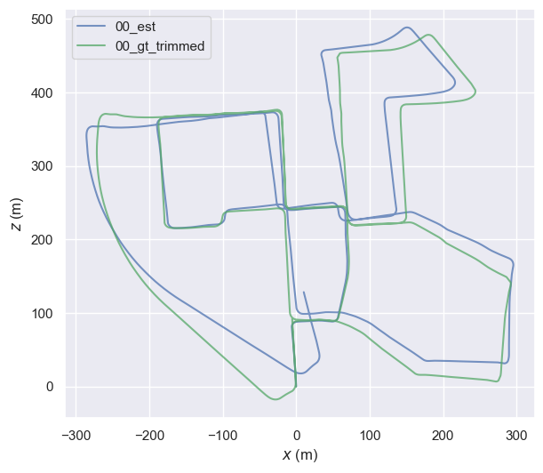
      <p>Estimated Trajectory and Groundtruth Trajectory</p>
    </td>
  </tr>
  <tr>
    <td style="text-align:center;">
      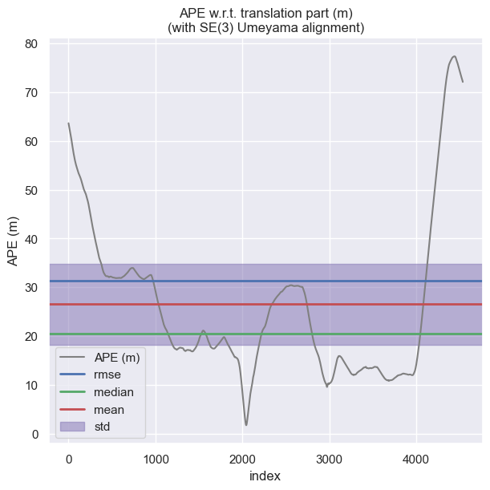
      <p>Absolute Pose Error</p>
    </td>
    <td style="text-align:center;">
      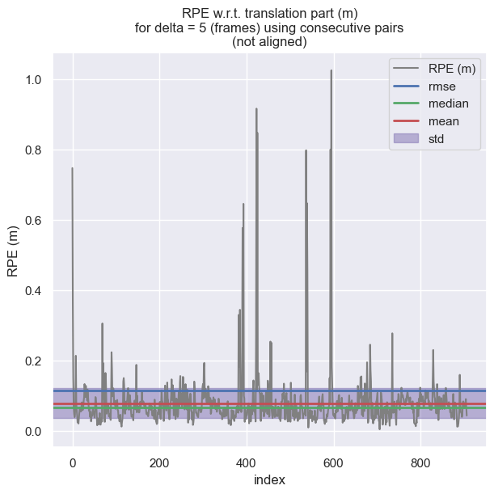
      <p>Relative Pose Error</p>
    </td>
  </tr>
</table>

### 01 Sequence

<table>
  <tr>
    <td colspan="2" style="display: flex; justify-content: center; text-align:center;">
      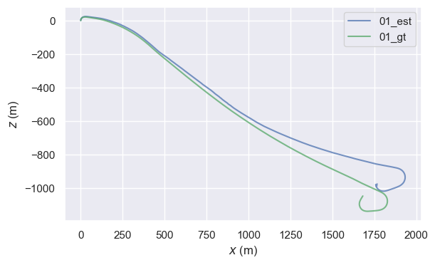
      <p>Estimated Trajectory and Groundtruth Trajectory</p>
    </td>
  </tr>
  <tr>
    <td style="text-align:center;">
      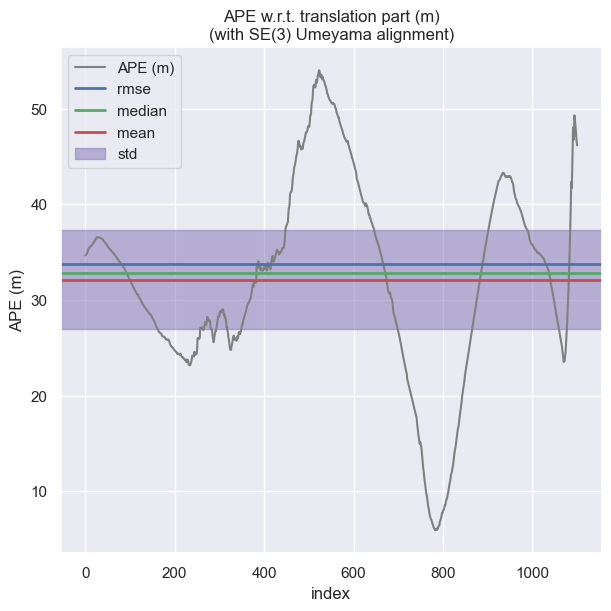
      <p>Absolute Pose Error</p>
    </td>
    <td style="text-align:center;">
      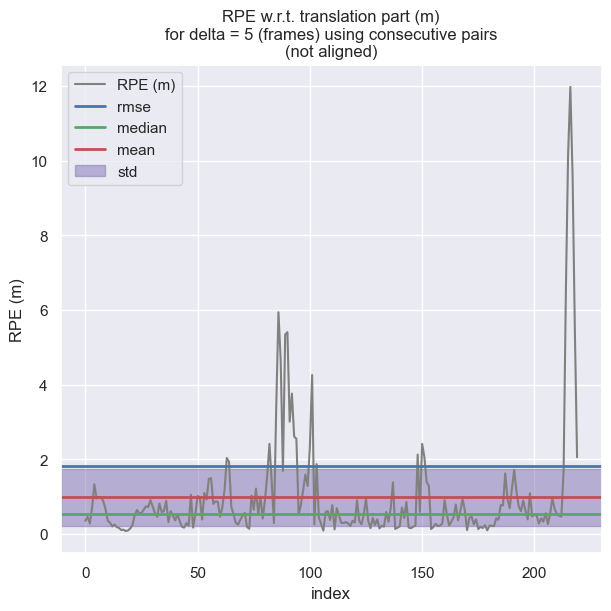
      <p>Relative Pose Error</p>
    </td>
  </tr>
</table>

### 02 Sequence

<table>
  <tr>
    <td colspan="2" style="display: flex; justify-content: center; text-align:center;">
      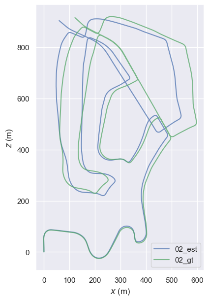
      <p>Estimated Trajectory and Groundtruth Trajectory</p>
    </td>
  </tr>
  <tr>
    <td style="text-align:center;">
      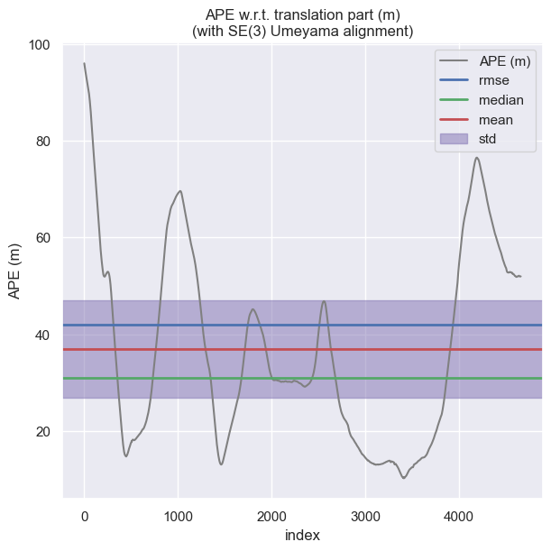
      <p>Absolute Pose Error</p>
    </td>
    <td style="text-align:center;">
      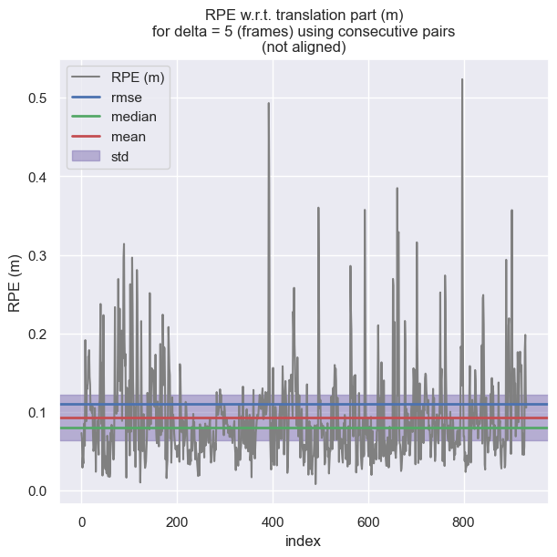
      <p>Relative Pose Error</p>
    </td>
  </tr>
</table>

### 03 Sequence

<table>
  <tr>
    <td colspan="2" style="display: flex; justify-content: center; text-align:center;">
      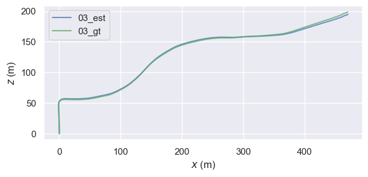
      <p>Estimated Trajectory and Groundtruth Trajectory</p>
    </td>
  </tr>
  <tr>
    <td style="text-align:center;">
      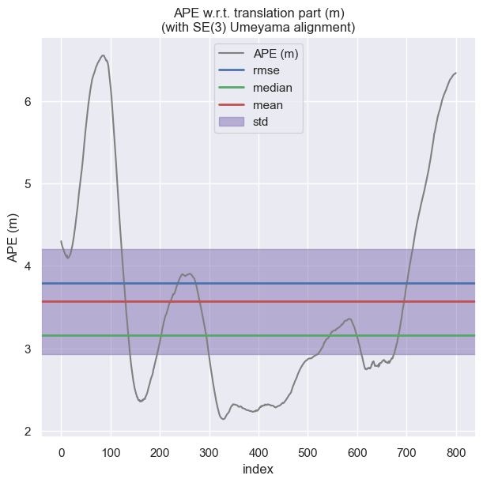
      <p>Absolute Pose Error</p>
    </td>
    <td style="text-align:center;">
      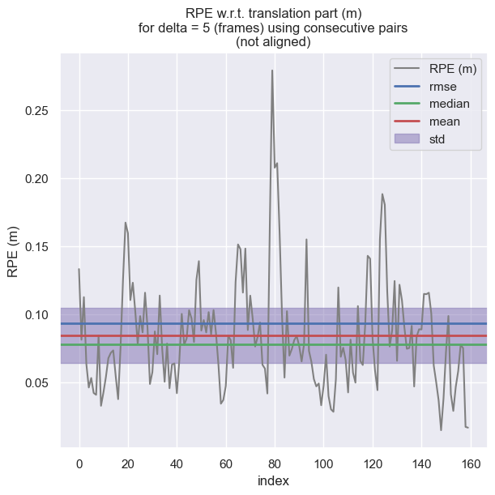
      <p>Relative Pose Error</p>
    </td>
  </tr>
</table>

### 05 Sequence

<table>
  <tr>
    <td colspan="2" style="display: flex; justify-content: center; text-align:center;">
      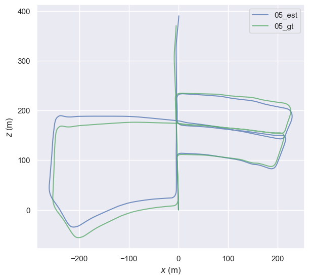
      <p>Estimated Trajectory and Groundtruth Trajectory</p>
    </td>
  </tr>
  <tr>
    <td style="text-align:center;">
      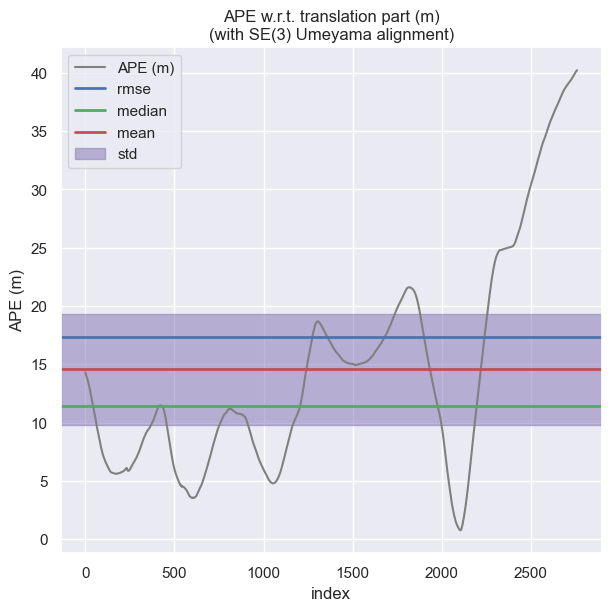
      <p>Absolute Pose Error</p>
    </td>
    <td style="text-align:center;">
      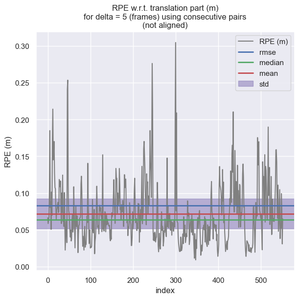
      <p>Relative Pose Error</p>
    </td>
  </tr>
</table>


### 06 Sequence

<table>
  <tr>
    <td colspan="2" style="display: flex; justify-content: center; text-align:center;">
      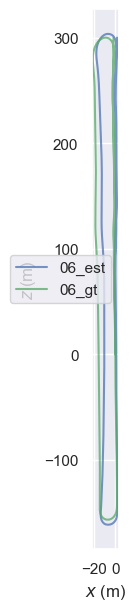
      <p>Estimated Trajectory and Groundtruth Trajectory</p>
    </td>
  </tr>
  <tr>
    <td style="text-align:center;">
      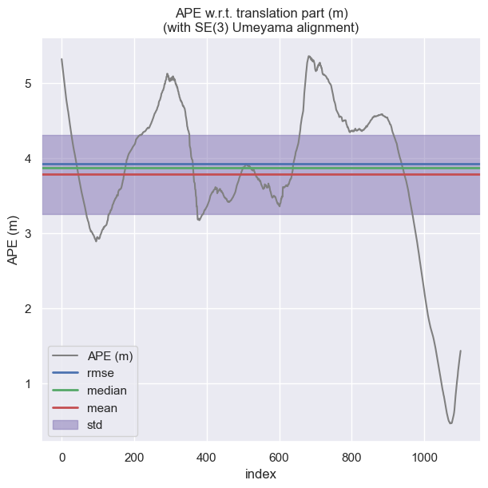
      <p>Absolute Pose Error</p>
    </td>
    <td style="text-align:center;">
      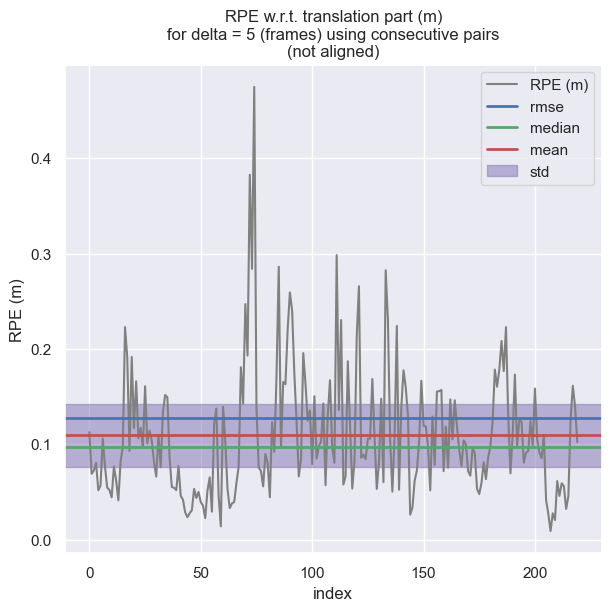
      <p>Relative Pose Error</p>
    </td>
  </tr>
</table>

### 07 Sequence

<table>
  <tr>
    <td colspan="2" style="display: flex; justify-content: center; text-align:center;">
      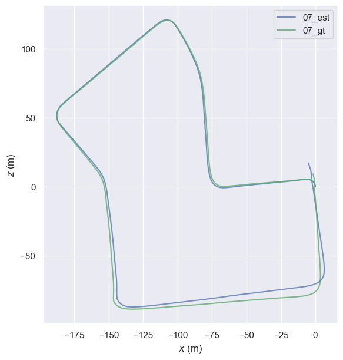
      <p>Estimated Trajectory and Groundtruth Trajectory</p>
    </td>
  </tr>
  <tr>
    <td style="text-align:center;">
      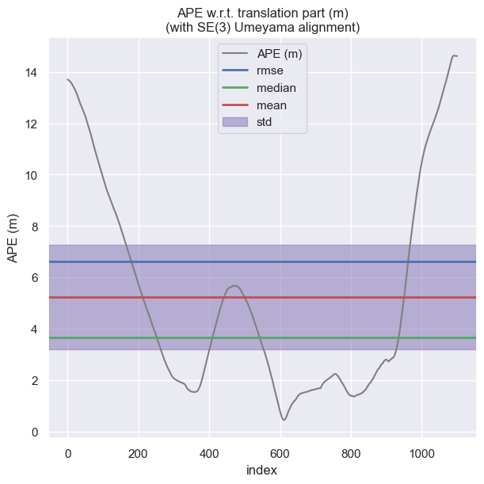
      <p>Absolute Pose Error</p>
    </td>
    <td style="text-align:center;">
      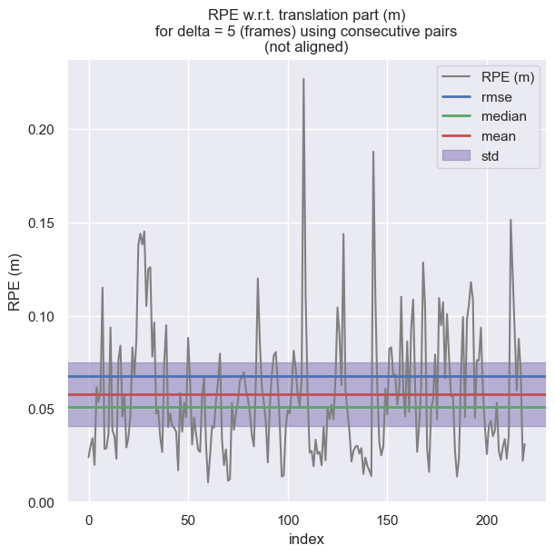
      <p>Relative Pose Error</p>
    </td>
  </tr>
</table>


### 08 Sequence

<table>
  <tr>
    <td colspan="2" style="display: flex; justify-content: center; text-align:center;">
      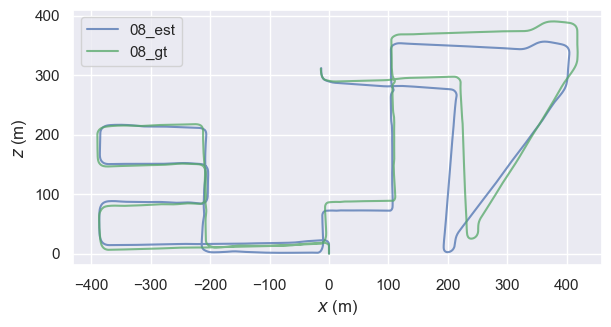
      <p>Estimated Trajectory and Groundtruth Trajectory</p>
    </td>
  </tr>
  <tr>
    <td style="text-align:center;">
      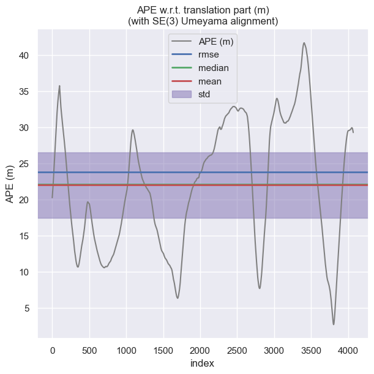
      <p>Absolute Pose Error</p>
    </td>
    <td style="text-align:center;">
      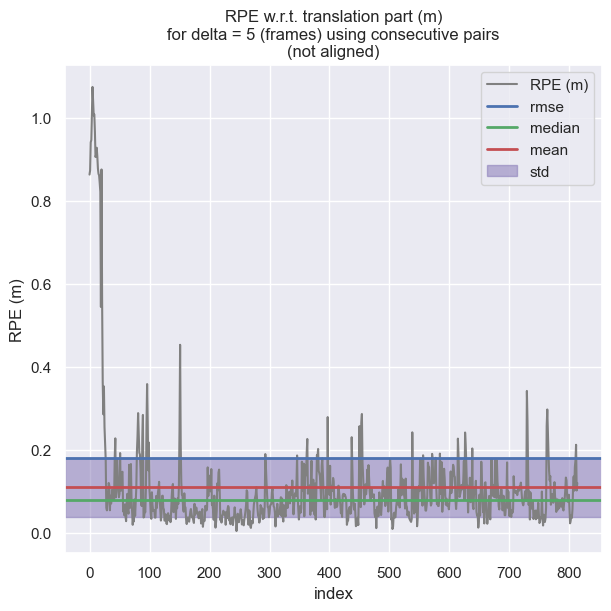
      <p>Relative Pose Error</p>
    </td>
  </tr>
</table>


### 09 Sequence

<table>
  <tr>
    <td colspan="2" style="display: flex; justify-content: center; text-align:center;">
      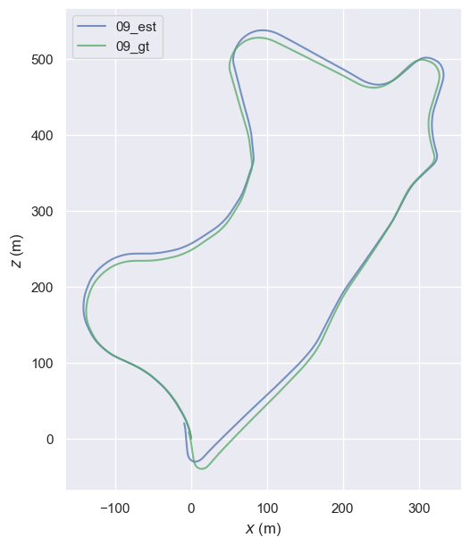
      <p>Estimated Trajectory and Groundtruth Trajectory</p>
    </td>
  </tr>
  <tr>
    <td style="text-align:center;">
      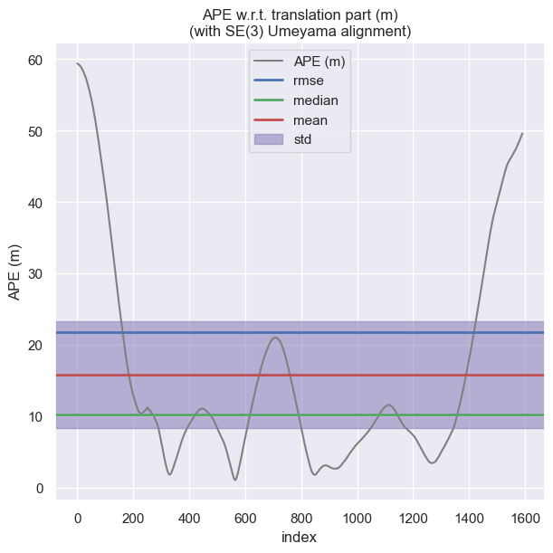
      <p>Absolute Pose Error</p>
    </td>
    <td style="text-align:center;">
      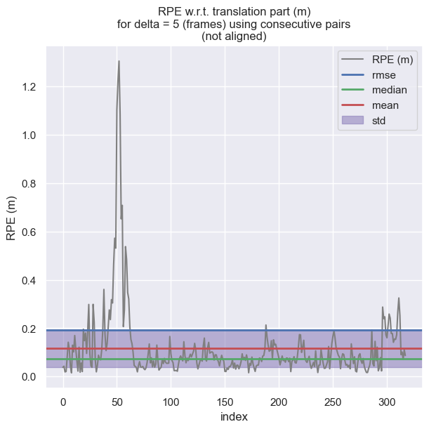
      <p>Relative Pose Error</p>
    </td>
  </tr>
</table>


### 10 Sequence

<table>
  <tr>
    <td colspan="2" style="display: flex; justify-content: center; text-align:center;">
      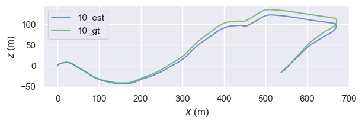
      <p>Estimated Trajectory and Groundtruth Trajectory</p>
    </td>
  </tr>
  <tr>
    <td style="text-align:center;">
      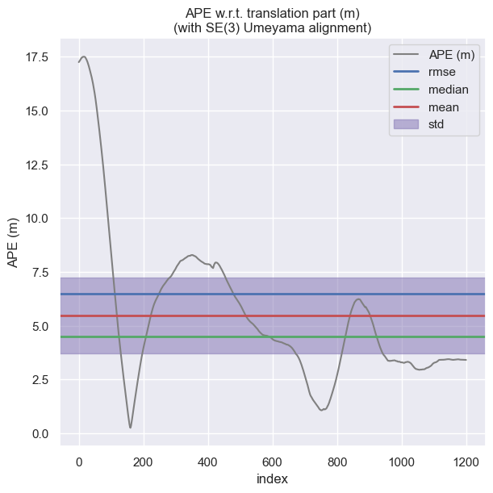
      <p>Absolute Pose Error</p>
    </td>
    <td style="text-align:center;">
      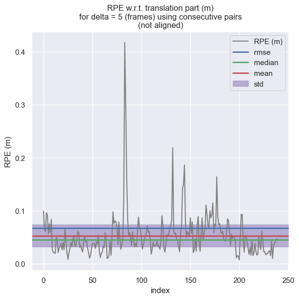
      <p>Relative Pose Error</p>
    </td>
  </tr>
</table>

## Authors
1. Fatima Yousif
2. Sawera Yaseen

